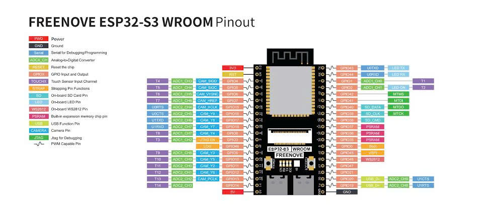
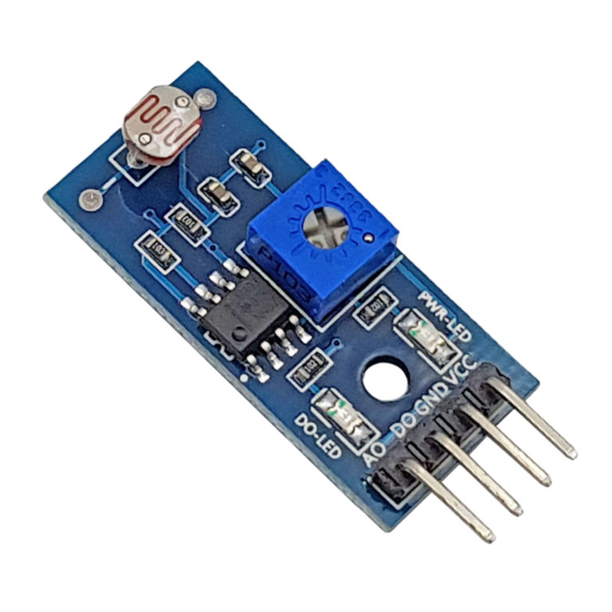
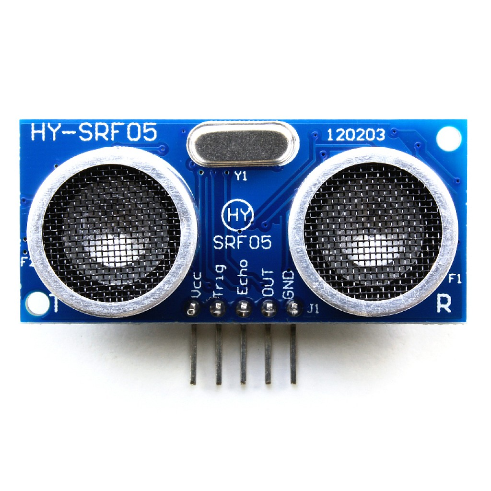
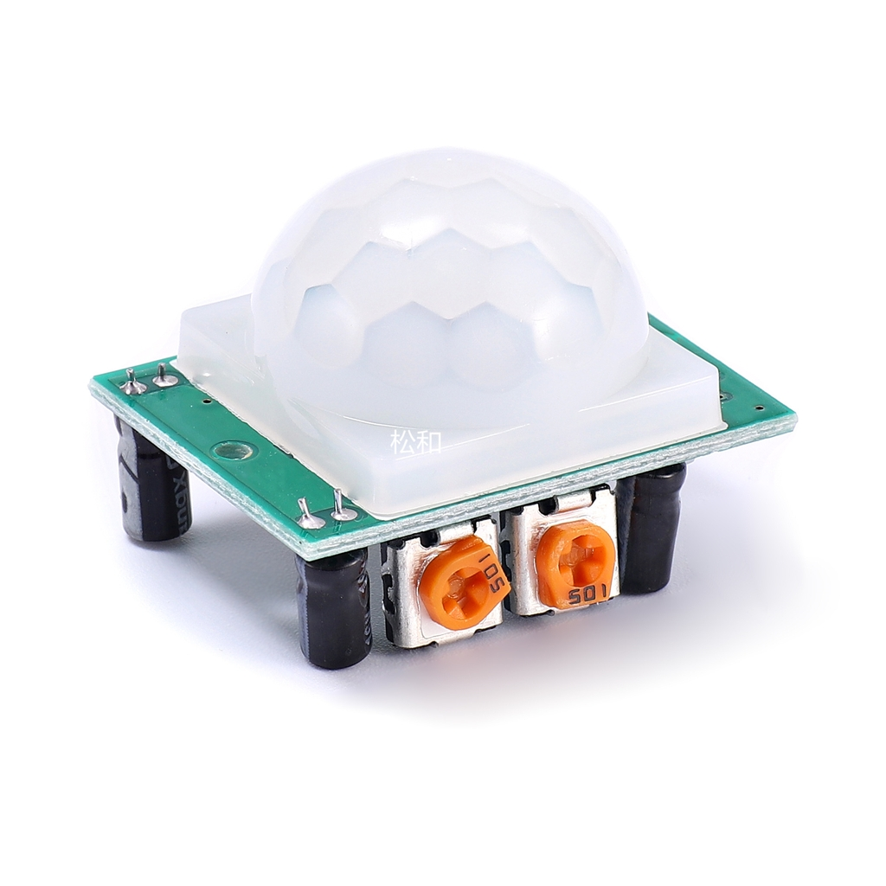

# Hardware Reference and Pin Guide

This guide identifies the components used by the current prototype. It is a reference, not a substitute for checking voltage levels and the pin definitions in the firmware before powering the circuit.

## Components

| Component | Purpose |
| --- | --- |
| Freenove ESP32-S3 WROOM + OV3660 | Main controller, WiFi, and image capture. |
| LDR MH-Sensor-Series | Ambient-light and sensor-cover monitoring. |
| HY-SRF05 | Distance measurement for intrusion and sabotage logic. |
| HC-SR501 PIR | Motion detection. |
| DS1307 RTC | Timekeeping and scheduled arming. |
| Buzzer and LEDs | Local audible and visual alerts. |

## ESP32-S3 Board Reference

*Figure 1. Freenove ESP32-S3 WROOM pinout reference.*

The board provides 3.3 V, 5 V, GND, GPIO, ADC, UART, camera, USB, and PSRAM-related pins. Camera signals share GPIO4-18 and GPIO46 as shown in the pinout. Do not repurpose a camera-assigned pin without updating and testing the camera configuration.

## Sensor References

### LDR Module

*Figure 2. LDR module used for light measurement and cover detection.*

Use `VCC`, `GND`, and the analog output (`AO`) required by the firmware. The digital output (`DO`) is available on the module but is not the primary reading used by the current logic.

### HY-SRF05 Ultrasonic Sensor

*Figure 3. HY-SRF05 sensor with VCC, Trig, Echo, OUT, and GND pins.*

The firmware uses the trigger and echo lines for distance readings. Check voltage compatibility before connecting Echo to the ESP32-S3.

### HC-SR501 PIR Sensor

*Figure 4. HC-SR501 PIR sensor for movement detection.*

Connect power, ground, and the output signal as defined by the current sketch. Adjust the module sensitivity and delay controls during calibration.

## Connection Constraints

- Use a common ground for every powered component.
- Confirm power requirements and logic levels before wiring sensors to ESP32 GPIOs.
- Keep the camera pin mapping reserved for the OV3660 configuration.
- Compare final wiring with the pin constants in `Kitchen_Security_System_-_Group_6_jun18a.ino`; code is the final source of truth.
