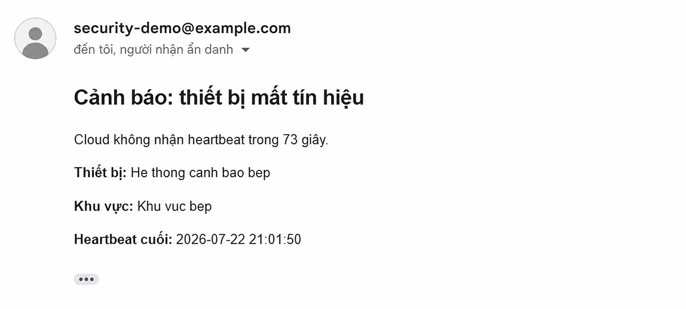

<div align="center">

# IoT Kitchen Security System

**A multi-sensor, ESP32-S3 security prototype for residential kitchen monitoring**

[](https://www.espressif.com/en/products/socs/esp32-s3)
[](https://www.arduino.cc/)


</div>

An educational, multi-sensor security prototype for a residential kitchen. The system uses an ESP32-S3 camera board to combine local sensor decisions with remote monitoring, image evidence, and notification services.

> **Current scope:** The maintained implementation uses a Freenove ESP32-S3 WROOM, OV3660 camera, PIR sensor, HY-SRF05 ultrasonic sensor, LDR module, DS1307 RTC, buzzer, and LEDs. Documentation and files in `docs/old/` are historical material and do not define the current system.

<p align="center">
  
</p>

<p align="center"><em>Freenove ESP32-S3 WROOM board reference used by the current firmware.</em></p>

## At a Glance

| Category | Current implementation |
| --- | --- |
| **Controller** | Freenove ESP32-S3 WROOM |
| **Vision** | OV3660 still-image camera |
| **Sensors** | PIR, HY-SRF05 ultrasonic sensor, LDR, DS1307 RTC |
| **Local response** | Buzzer, red LED, green LED |
| **Remote services** | Arduino IoT Cloud, Telegram, optional Gemini, Google Apps Script |
| **Decision model** | Local sensor logic first; cloud and AI provide state, delivery, and supporting evidence |
| **Project type** | IOT102 academic prototype - Group 6 |

## Table of Contents

- [Features](#features)
- [Architecture](#architecture)
- [Hardware](#hardware)
- [Repository Structure](#repository-structure)
- [Prerequisites](#prerequisites)
- [Installation and Configuration](#installation-and-configuration)
- [Operating Modes and Event Flow](#operating-modes-and-event-flow)
- [Arduino IoT Cloud](#arduino-iot-cloud)
- [Testing and Demo](#testing-and-demo)
- [Security and Safety](#security-and-safety)
- [Troubleshooting](#troubleshooting)
- [Documentation](#documentation)

## Features

| Capability | How it works | Evidence shown to the user |
| --- | --- | --- |
| **Multi-sensor intrusion detection** | PIR movement and ultrasonic distance readings must meet the configured conditions after the boot grace period. | `intrusion_alert`, local alarm output, Cloud event state, optional photo. |
| **Anti-sabotage monitoring** | The firmware checks LDR cover/abnormal-light conditions and a near-distance condition. | `sabotage_alert`, alarm status, and a follow-up health-monitoring workflow. |
| **Local alerting** | Red/green LEDs and a buzzer are controlled locally, so the primary alarm decision does not depend on a cloud response. | Visible LED state and audible buzzer. |
| **OV3660 photo evidence** | The camera captures still photos automatically for eligible events or on a manual dashboard request. | `photo_status` and the captured image delivery result. |
| **Arduino IoT Cloud control** | The dashboard exposes security state, schedule, camera, notification, and SOS controls. | Live Cloud properties and dashboard status cards. |
| **Telegram delivery** | A configured bot can receive event photos when WiFi and credentials are available. | `notification_sent_status` and Telegram photo delivery. |
| **Heartbeat monitoring** | The device reports periodic health information to the optional Apps Script workflow. | `heartbeat_status` and `last_heartbeat_time`. |
| **Optional Gemini evidence** | Gemini can classify a captured photo as person/no-person. | Supplementary image evidence only; it never overrides sensor logic. |

### What This Project Does Not Claim

- It is **not** a certified alarm, fire-safety, surveillance, or emergency-response system.
- It does **not** use facial recognition, RFID access control, WiFi/MAC scanning, or automatic contact with public authorities.
- It does **not** treat an offline heartbeat as proof that a device has been damaged or powered off.

## Architecture

```text
PIR + HY-SRF05 + LDR + DS1307 RTC
                 |
                 v
      Freenove ESP32-S3 WROOM + OV3660
        |             |              |
        v             v              v
  Buzzer and LEDs  Arduino IoT Cloud  Telegram / Google Apps Script
```

The device makes the security decision locally. Cloud services receive state and evidence when available; loss of a heartbeat means that contact was lost, not that physical sabotage has been proven.

## Hardware

| Component | Role |
| --- | --- |
| Freenove ESP32-S3 WROOM + OV3660 | Main controller, WiFi connectivity, and camera capture. |
| HC-SR501 PIR | Detects motion in the monitored area. |
| HY-SRF05 ultrasonic sensor | Measures distance for intrusion and sabotage conditions. |
| MH-Sensor-Series LDR module | Measures light and helps detect sensor covering. |
| DS1307 RTC | Provides time for display and scheduled arming/disarming. |
| Red LED, green LED, buzzer | Provide local visual and audible feedback. |

### Firmware Pin Assignment

The following assignments are defined in the current sketch. Do not change them without updating the firmware and validating the complete circuit.

| Device signal | ESP32-S3 pin |
| --- | ---: |
| LDR analog output | GPIO 1 |
| PIR output | GPIO 40 |
| DS1307 SDA / SCL | GPIO 41 / GPIO 42 |
| Red LED / green LED | GPIO 14 / GPIO 21 |
| Buzzer | GPIO 47 |
| HY-SRF05 Trig / Echo | GPIO 38 / GPIO 39 |

See the [hardware reference and pin guide](docs/requirements/HARDWARE_WIRING.md) for component images, pin descriptions, and connection constraints.

### Sensor Gallery

<p align="center">
  
  
  
</p>

<p align="center"><em>Left to right: HC-SR501 PIR motion sensor, HY-SRF05 ultrasonic sensor, and LDR light-sensor module.</em></p>

## Repository Structure

```text
.
├── Firmware/
│   └── Kitchen_Security_System/
│       ├── gg-app-script-email.js
│       └── Kitchen_Security_System_-_Group_6_jun18a/
│           ├── Kitchen_Security_System_-_Group_6_jun18a.ino
│           ├── thingProperties.h
│           ├── arduino_secrets.example.h
│           └── ReadMe.adoc
├── Hardware/                 # Component and board reference images
├── docs/
│   ├── requirements/         # Maintained English technical documents
│   ├── reports/              # Submitted report, slide deck, and demo link
│   ├── images/               # Project images and evidence
│   └── old/                  # Unmaintained historical material
├── LICENSE
└── README.md
```

## Prerequisites

Before building the firmware, install and prepare:

- [Arduino IDE](https://www.arduino.cc/en/software).
- The Espressif ESP32 board package with target `esp32:esp32:esp32s3`.
- An Arduino IoT Cloud account, device, Thing, and dashboard if cloud control is required.
- A WiFi network reachable by the board.
- A Telegram bot and chat ID if Telegram delivery is required.
- A deployed Google Apps Script URL if heartbeat and simulated escalation are required.
- An optional Gemini API key if image classification is required.

The sketch includes `Wire.h`, `RTClib.h`, `esp_camera.h`, `WiFi.h`, `WiFiClientSecure.h`, Arduino IoT Cloud, and Arduino connection-handler headers. Install any missing library through Arduino IDE before compiling.

## Installation and Configuration

### 1. Clone the Repository

```bash
git clone https://github.com/<your-account>/iot-kitchen-security-system.git
cd iot-kitchen-security-system
```

### 2. Wire the Prototype

Connect the ESP32-S3, sensors, RTC, LEDs, and buzzer according to the [hardware guide](docs/requirements/HARDWARE_WIRING.md). Use a common ground and verify every component's voltage and logic-level requirements before connecting it to the ESP32-S3.

### 3. Configure Local Secrets

Open the firmware directory:

```text
Firmware/Kitchen_Security_System/Kitchen_Security_System_-_Group_6_jun18a/
```

Copy `arduino_secrets.example.h` to `arduino_secrets.h`, then replace all placeholders with your own values:

```cpp
#define SECRET_SSID "YOUR_WIFI_SSID"
#define SECRET_OPTIONAL_PASS "YOUR_WIFI_PASSWORD"
#define SECRET_DEVICE_KEY "YOUR_ARDUINO_CLOUD_DEVICE_KEY"
#define SECRET_DEVICE_NAME "YOUR_ARDUINO_CLOUD_DEVICE_NAME"
#define SECRET_DEVICE_LOCATION "YOUR_ARDUINO_CLOUD_DEVICE_LOCATION"
#define SECRET_TELEGRAM_BOT_TOKEN "YOUR_TELEGRAM_BOT_TOKEN"
#define SECRET_TELEGRAM_CHAT_ID "YOUR_TELEGRAM_CHAT_ID"
#define SECRET_GEMINI_API_KEY "YOUR_OPTIONAL_GEMINI_API_KEY"
#define SECRET_GOOGLE_SCRIPT_URL "YOUR_PRIVATE_APPS_SCRIPT_URL"
```

`arduino_secrets.h` is ignored by Git. Never commit credentials, bot tokens, private URLs, recipient addresses, or home addresses.

### 4. Configure Arduino IoT Cloud

Create an Arduino IoT Cloud Thing and configure properties that match [`thingProperties.h`](Firmware/Kitchen_Security_System/Kitchen_Security_System_-_Group_6_jun18a/thingProperties.h). Key properties include:

- Read/write controls: `alarm_enabled`, `camera_enabled`, `auto_photo_on_alert`, `telegram_enabled`, `schedule_enabled`, `manual_capture_photo`, `reset_alarm`, `sos_adult`, and `sos_child`.
- Read-only state: `alarm_status`, `system_armed`, `intrusion_alert`, `sabotage_alert`, `photo_status`, `notification_sent_status`, `heartbeat_status`, and `last_event`.
- Scheduling controls: `auto_arm_hour`, `auto_arm_minute`, `auto_disarm_hour`, and `auto_disarm_minute`.

The property names and callbacks in `thingProperties.h` are authoritative. Do not create a dashboard with different names or types.

<p align="center">
  
</p>

<p align="center"><em>Parent Control Dashboard: alarm state, camera controls, notifications, device monitoring, and optional service controls.</em></p>

### 5. Compile and Upload

1. Open `Kitchen_Security_System_-_Group_6_jun18a.ino` in Arduino IDE.
2. Select **ESP32S3 Dev Module** or the matching `esp32:esp32:esp32s3` board target.
3. Select the correct serial port.
4. Verify the sketch, resolve any missing libraries, and upload it.
5. Open Serial Monitor and confirm that the camera, RTC, WiFi, and Cloud connection initialize successfully.

## Operating Modes and Event Flow

### Intrusion Detection

After a three-second boot grace period, PIR motion combined with a configured ultrasonic distance range for the required hold time can trigger an intrusion. The firmware then updates Cloud state, activates local outputs, and may capture/send a photo when the corresponding controls are enabled.

### Anti-Sabotage Detection

The system monitors LDR conditions and near-distance readings to identify configured interference conditions. Sabotage events take priority over ordinary intrusion monitoring. Sensor thresholds should be calibrated in the real installation environment.

### Scheduling

When scheduling is enabled, the DS1307 RTC determines automatic arming and disarming using the configured dashboard hours and minutes. Confirm the RTC time before relying on a schedule.

<p align="center">
  
</p>

<p align="center"><em>Dashboard controls for alarm sensitivity and scheduled arming/disarming.</em></p>

### SOS and Health Monitoring

SOS controls latch an alarm and can invoke the Google Apps Script workflow. Heartbeats are sent every ten seconds when enabled and connected. Any simulated escalation requires human confirmation; it must never be described as direct emergency-service integration.

## Remote Evidence and Notification Flow

The project is designed to make a security event understandable from the device outward: local sensors establish the event, the OV3660 camera captures evidence, and connected services deliver status or a photo when they are enabled and reachable.

```text
Sensor event -> Local alarm decision -> OV3660 still photo -> Telegram evidence
                         |
                         +-> Arduino IoT Cloud state -> heartbeat / simulated Gmail workflow
```

### Telegram Photo and AI Evidence

When an eligible event occurs and `camera_enabled` plus `telegram_enabled` are enabled, the device captures an OV3660 still image and sends it to the configured Telegram chat. If `gemini_enabled` is also enabled, the image can receive a supplementary person/no-person classification. The classification is evidence for the recipient; the sensor event remains the trigger for the security action.

<p align="center">
  
</p>

<p align="center"><em>Telegram evidence message: a captured camera photo, event metadata, and an optional AI result indicating that a person was detected in the image.</em></p>

### Gmail Health and Important-Event Notification

When Google Apps Script monitoring is enabled, the device submits periodic heartbeats. If the Cloud workflow does not receive a heartbeat within its configured threshold, it can send a Gmail alert asking the owner to check WiFi, power, and the device. The alert is a **loss-of-contact warning**, not proof that the device was physically damaged. SOS and critical-security workflows require a human confirmation step before the simulated escalation process continues.

<p align="center">
  
</p>

<p align="center"><em>Privacy-safe Gmail example: the Cloud did not receive a heartbeat within the configured interval and requests a device check.</em></p>

## Testing and Demo

Use the [official demo scenarios](docs/requirements/DEMO_SCENARIOS_V1.0.0.md) to test the prototype in a reproducible order:

1. Normal operation and connection recovery.
2. Intrusion detection and Telegram photo delivery.
3. Active sabotage and degraded operation.
4. Scheduled arming and disarming.
5. SOS with simulated escalation confirmation.
6. Manual camera capture.
7. Optional Gemini image classification.

The submitted presentation includes a [demo video](https://youtu.be/31cwnySxrOI).

## Security and Safety

- This is an educational prototype, not a certified alarm or emergency-response system.
- Do not expose real addresses, service URLs, API keys, emails, chat IDs, or credentials in GitHub screenshots or documentation.
- Do not claim that a heartbeat timeout proves power loss or physical sabotage.
- Do not claim that Gemini provides identity verification, facial recognition, or a final security decision.
- Use simulated contacts for all emergency-workflow demonstrations.

## Troubleshooting

| Symptom | Checks |
| --- | --- |
| Camera does not initialize | Confirm the correct ESP32-S3 board target and preserve the camera pin mapping. |
| Cloud variables do not update | Verify WiFi, Arduino IoT Cloud credentials, property names, and Thing configuration. |
| Telegram notification fails | Check bot token, chat ID, WiFi connectivity, and `telegram_enabled`. |
| Schedule runs at the wrong time | Check DS1307 wiring, RTC initialization, and the configured arm/disarm values. |
| False intrusion or sabotage alerts | Recheck sensor placement and calibrate LDR/distance thresholds in the sketch. |
| No heartbeat event | Verify `heartbeat_enabled`, `google_script_enabled`, and the private Apps Script URL. |

## Documentation

| Document | Purpose |
| --- | --- |
| [Documentation index](docs/README.md) | Entry point for project documentation. |
| [Software Requirements Specification](docs/requirements/SRS.md) | Current scope, requirements, interface contract, and acceptance criteria. |
| [Hardware Reference](docs/requirements/HARDWARE_WIRING.md) | Component guide, visuals, and connection constraints. |
| [Demo Scenarios](docs/requirements/DEMO_SCENARIOS_V1.0.0.md) | Test procedures and expected evidence. |
| [Submitted Deliverables](docs/reports/README.md) | Final report, presentation, and demo-link artifact. |

Vietnamese copies of supporting technical documents use the `.vi.md` suffix. `docs/old/` remains an unmaintained archive and is intentionally excluded from the current scope.

## Team

**IOT102 - Internet of Things, Group 6**

- Ngo Gia Long
- Vo Tran Cong Danh
- Nguyen An Vuong
- Nguyen Nhat Anh

## License

This project is distributed under the [license](LICENSE) in this repository.
