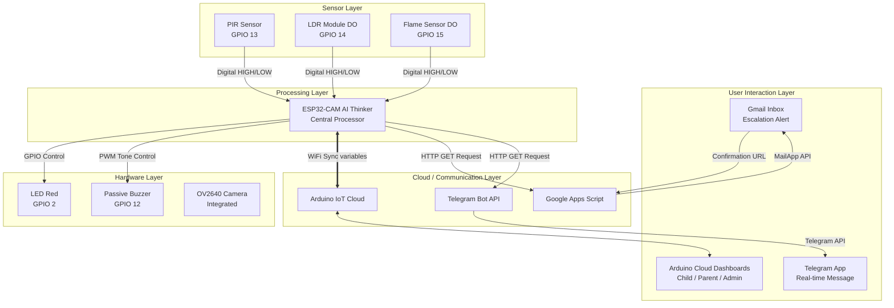

# BÁO CÁO PHÂN TÍCH DỰ ÁN IOT KITCHEN SECURITY SYSTEM
## PHỤC VỤ SOẠN THẢO SCIENTIFIC REPORT (LaTeX - ENGLISH)

| Dự án | IoT-Based Multi-Sensor Anti-Theft System for Kitchen Security |
|---|---|
| Môn học | IOT102 - Internet of Things |
| Lớp | SE2034 |
| Nhóm thực hiện | Nhóm 6 (Group 6) |
| Phiên bản dự án | 2.0.5 |
| Ngày lập báo cáo | 21 tháng 06, 2026 |

---

## 1. Tổng quan dự án

### 1.1. Tên dự án hiện tại
* **Tên tiếng Anh chính thức (theo cấu hình hệ thống):** *IoT-Based Multi-Sensor Anti-Theft System* (hoặc tên đầy đủ trong tài liệu: *IoT based anti-theft system for kitchen area*).
* **Tên tiếng Việt:** Hệ thống chống trộm IoT đa cảm biến cho khu vực phòng bếp.

### 1.2. Mục tiêu chính của hệ thống
Hệ thống được thiết kế nhằm mục đích xây dựng một giải pháp giám sát an ninh thông minh, kết hợp công nghệ IoT và xử lý đa cảm biến (Sensor Fusion) để bảo vệ khu vực phòng bếp gia đình. Các mục tiêu cụ thể bao gồm:
* **Giám sát thời gian thực (Real-time Monitoring):** Liên tục theo dõi các thông số môi trường (chuyển động, ánh sáng, nhiệt độ, nguy cơ cháy).
* **Nhận diện đột nhập chính xác:** Phối hợp thông tin từ nhiều nguồn cảm biến để giảm thiểu báo động giả (false alarms) do môi trường hoặc vật nuôi (pet filtering).
* **Cảnh báo đa kênh (Multi-channel Alerting):** Phát cảnh báo tại chỗ (còi, đèn LED) kết hợp gửi thông báo từ xa qua Cloud Dashboard, email (Gmail) và tin nhắn Telegram.
* **Hỗ trợ khẩn cấp thông minh (Emergency SOS Escalation):** Cung cấp các mức độ SOS khác nhau cho trẻ em và người lớn, hỗ trợ cơ chế xác nhận phản hồi khẩn cấp từ xa.
* **Chống phá hoại thiết bị (Anti-Sabotage):** Phát hiện các hành vi che khuất hoặc phá hỏng cảm biến.

### 1.3. Bài toán thực tế mà hệ thống giải quyết
* **Rủi ro mất an toàn phòng bếp:** Bếp là nơi dễ xảy ra các sự cố cháy nổ (rò rỉ gas, quên bếp) và cũng là khu vực có nhiều lối vào phụ (cửa sổ, cửa sau) dễ bị kẻ trộm lợi dụng xâm nhập.
* **Hạn chế của hệ thống an ninh truyền thống:** Báo động giả gây phiền hà cho chủ nhà; hệ thống cục bộ không thể thông báo khi chủ nhà đi vắng; thiếu sự phân quyền hoặc hỗ trợ khẩn cấp cho trẻ em/người già khi ở nhà một mình.
* **Vấn đề báo động giả từ thú cưng:** Các cảm biến chuyển động hồng ngoại (PIR) thông thường dễ bị kích hoạt bởi chó, mèo di chuyển dưới sàn bếp.
* **Rủi ro phá hoại thiết bị:** Kẻ trộm có thể dùng vải che cảm biến hoặc tìm cách ngắt kết nối thiết bị trước khi thực hiện hành vi đột nhập.

### 1.4. Đối tượng sử dụng hệ thống
* **Hộ gia đình:** Đặc biệt là các gia đình có con nhỏ (trẻ em cần nút SOS đơn giản để gọi bố mẹ) hoặc người cao tuổi ở nhà một mình.
* **Chủ nhà hay đi vắng:** Có nhu cầu giám sát nhà cửa từ xa qua thiết bị di động.
* **Người nuôi thú cưng:** Cần một hệ thống thông minh không hú còi vô cớ mỗi khi thú cưng di chuyển trong bếp.

---

## 2. Kiến trúc hệ thống hiện tại

Kiến trúc hệ thống được chia làm 5 tầng (layers) chính theo mô hình IoT tiêu chuẩn:

### 2.1. Phân tích các tầng (Layers) của hệ thống
* **1. Hardware Layer (Tầng thiết bị/chấp hành):** 
  * Bộ vi điều khiển trung tâm: **ESP32-CAM AI Thinker** (kèm board nạp **ESP32-CAM-MB**).
  * Thiết bị phát cảnh báo tại chỗ: Còi báo động thụ động (Passive Buzzer 1407), Đèn LED đỏ hiển thị trạng thái.
  * Thiết bị ghi nhận hình ảnh: Camera OV2640 tích hợp sẵn trên mạch.
* **2. Sensor Layer (Tầng cảm biến):**
  * Cảm biến chuyển động hồng ngoại **PIR** (HC-SR501/5050).
  * Cảm biến ánh sáng **LDR** (dùng module so sánh Op-Amp xuất ngõ ra Digital DO).
  * Cảm biến phát hiện ngọn lửa **Flame Sensor** (xuất ngõ ra Digital DO).
* **3. Processing Layer (Tầng xử lý):**
  * Vi điều khiển **ESP32-CAM** thực hiện:
    * Đọc chu kỳ tín hiệu từ các cảm biến qua chân GPIO (300ms/lần).
    * Chạy thuật toán logic phát hiện sự kiện (Đột nhập, Cháy, Phá hoại).
    * Xử lý đếm số lần bấm nút trong cửa sổ thời gian (3 giây) để xác định mức SOS (`sos_level`).
    * Điều khiển nhấp nháy LED đỏ và phát âm thanh còi bằng hàm `tone()` (tần số 2000Hz).
    * Thực thi cơ chế chống spam tin nhắn (`TYPE_ALERT_COOLDOWN_MS = 60000ms`).
    * Quản lý giao tiếp mạng WiFi, đồng bộ trạng thái biến lên Arduino IoT Cloud.
* **4. Cloud / Communication Layer (Tầng truyền thông và đám mây):**
  * **Arduino IoT Cloud:** Đóng vai trò máy chủ trung gian đồng bộ các biến trạng thái (`variables`) thời gian thực giữa phần cứng và phần mềm điều khiển.
  * **Google Apps Script:** Đóng vai trò Web App trung gian nhận yêu cầu HTTP GET từ ESP32-CAM để thực hiện gửi Gmail phân cấp và tạo đường link xác nhận khẩn cấp (Escalation Link).
  * **Telegram Bot API:** Sử dụng kết nối HTTPS để gửi tin nhắn cảnh báo trực tiếp từ ESP32-CAM về điện thoại người dùng.
* **5. User Interaction Layer (Tầng tương tác người dùng):**
  * **Giao diện điều khiển (Dashboard):** 3 Dashboard trên Arduino IoT Cloud (Child, Parent, Admin) phục vụ các đối tượng khác nhau.
  * **Ứng dụng nhận thông báo:** Hộp thư Gmail (nhận cảnh báo khẩn cấp có đính kèm nút xác nhận chuyển tiếp cứu hộ/công an) và ứng dụng Telegram (nhận tin nhắn cảnh báo dạng văn bản tiếng Việt).

### 2.2. Mô tả luồng dữ liệu (Data Flow)
1. **Thu thập dữ liệu:** Các cảm biến PIR, LDR, Flame liên tục thay đổi trạng thái điện áp ngõ ra tương ứng với môi trường. ESP32-CAM quét các chân GPIO mỗi 300ms để đọc trạng thái.
2. **Đánh giá sự kiện tại Local:** 
   * Nếu phát hiện lửa (`flame == LOW`), hệ thống lập tức kích hoạt sự kiện Cháy (`fire_alert = true`).
   * Nếu hệ thống đang bật bảo vệ (`system_armed == true`) mà LDR bị che tối đen (`ldr == HIGH`) đồng thời có chuyển động (`pir == HIGH`), hệ thống kích hoạt sự kiện Phá hoại (`sabotage_alert = true`).
3. **Kích hoạt phản hồi Local:** ESP32-CAM chuyển trạng thái cảnh báo sang nhấp nháy LED và hú còi Buzzer tại chỗ bằng luồng không đồng bộ.
4. **Đồng bộ Cloud:** Trạng thái hệ thống (`alarm_status = "FIRE_ALERT"`, `"SABOTAGE_ALERT"`,...) và các thông số cảm biến (`flame_value`, `ldr_value`, `kitchen_temperature`) được gửi lên Arduino IoT Cloud.
5. **Gửi cảnh báo từ xa (Remote Alert):**
   * ESP32-CAM thực hiện gửi HTTPS GET request đến API Telegram Bot để đẩy tin nhắn văn bản về nhóm chat đã thiết lập.
   * Đồng thời, gửi HTTP GET request chứa thông tin sự kiện đến URL Web App của Google Apps Script. Google Apps Script biên dịch thông tin và gửi Gmail đến danh sách người lớn (`family`).
6. **Xác nhận khẩn cấp (Escalation - SOS Mức 3 / Cháy):**
   * Người lớn nhận được Gmail có chứa nút bấm liên kết dạng: `https://script.google.com/macros/s/.../exec?action=confirm&eventId=...&originalType=...&escalationTarget=...`.
   * Khi người dùng click nút này trên điện thoại hoặc máy tính, Google Apps Script sẽ kiểm tra xem sự kiện đã được xử lý chưa (dùng `PropertiesService` để lock). Nếu chưa, nó sẽ gửi tiếp email đến hòm thư giả lập của Công an/Cứu hỏa và gửi email phản hồi báo lại cho gia đình rằng sự cố đang được xử lý.

---

## 3. Phần cứng đang dùng

### 3.1. Bảng kê chi tiết phần cứng thực tế vs Bản vẽ lý thuyết
Trong dự án này, có một sự khác biệt rất lớn giữa **Tài liệu hướng dẫn kết nối phần cứng (Docs/Hardware Design)** và **Code thực tế đang chạy trong Firmware**. Điều này là điểm nhấn khoa học cực kỳ quan trọng cần được đưa vào Scientific Report để phân tích hạn chế phần cứng của chip ESP32-CAM.

| Tên thiết bị | Chức năng lý thuyết (Docs) | Sử dụng trong Code thực tế | Chân kết nối lý thuyết (Docs) | Chân kết nối thực tế (Code .ino) | Ghi chú khoa học cho báo cáo (Scientific Note) |
|---|---|---|---|---|---|
| **ESP32-CAM (AI Thinker)** | Vi xử lý trung tâm, kết nối WiFi | Vi xử lý trung tâm, kết nối WiFi | N/A | N/A | Chip ESP32-CAM bị giới hạn số lượng GPIO khả dụng do camera OV2640 và khe thẻ SD chiếm dụng hầu hết các chân. |
| **ESP32-CAM-MB** | Shield nạp code USB-to-TTL, cấp nguồn | Cấp nguồn, nạp chương trình | N/A | N/A | Hỗ trợ nạp code qua cổng Micro USB và ổn định nguồn 5V/2A cho kit. |
| **Camera OV2640** | Chụp ảnh hiện trường khi đột nhập | **Tạm ngắt trong code** (chỉ có biến demo) | Gắn sẵn trên khe FPC của kit | Gắn sẵn trên khe FPC | Trong callback `onCapturePhotoChange`, chức năng chụp ảnh bị tắt do truyền tải ảnh qua thư viện Cloud không ổn định. |
| **PIR HC-SR501/5050** | Phát hiện chuyển động hồng ngoại | Có sử dụng (Active HIGH) | **GPIO 3** | **GPIO 13** | GPIO 3 trùng chân RX0 của mạch nạp. Nếu cắm chân này, việc nạp code và debug Serial sẽ bị lỗi/nhiễu. Code thực tế đã chuyển sang GPIO 13. |
| **LDR Module** | Đo cường độ ánh sáng (Analog/Digital) | Có sử dụng (Active HIGH) | **GPIO 33 (Analog AO)** | **GPIO 14 (Digital DO)** | ESP32-CAM không thể đọc Analog trên chân GPIO 33 khi WiFi đang bật (do xung đột bộ ADC2). Code phải chuyển sang đọc ngõ ra Digital (DO) trên GPIO 14. |
| **Flame Sensor** | Phát hiện ngọn lửa hồng ngoại | Có sử dụng (Active LOW) | **GPIO 4 (Digital DO)** | **GPIO 15 (Digital DO)** | GPIO 4 trùng với chân Flash LED công suất lớn của ESP32-CAM. Nếu dùng chân này, đèn Flash sẽ nháy sáng liên tục khi cảm biến đổi trạng thái. Code chuyển sang GPIO 15. |
| **Buzzer (Passive)** | Phát âm thanh báo động | Có sử dụng (Active HIGH, phát tone) | **GPIO 2** | **GPIO 12** | GPIO 2 của ESP32-CAM nối với Led tích hợp và là chân Boot (IO2). Cắm Buzzer vào IO2 dễ gây lỗi boot nạp. Code thực tế chuyển sang GPIO 12. |
| **LED Đỏ** | Cảnh báo trạng thái tại chỗ | Có sử dụng (Active HIGH) | **GPIO 12** | **GPIO 2** | Code thực tế chuyển LED đỏ sang GPIO 2 (Led đỏ nhỏ tích hợp trên board ESP32-CAM cũng nằm trên IO2). |
| **RFID RC522** | Xác thực thẻ từ Arm/Disarm | **Không tích hợp trong code** | SDA=IO13, MOSI=IO2, SCK=IO12, MISO=IO16, RST=IO0 | Không sử dụng | **Xung đột chân nghiêm trọng:** Nếu kết nối SPI của RC522 như sơ đồ lý thuyết, nó sẽ chiếm dụng toàn bộ các chân IO2, IO12, IO13 vốn đang dùng cho Buzzer, LED và PIR. |
| **DS1307 RTC** | Lưu thời gian thực | **Không tích hợp trong code** | SDA=IO14, SCL=IO15 | Không sử dụng | **Xung đột chân:** Kết nối I2C cho RTC chiếm IO14 và IO15, trùng chân với LDR và Flame trong code thực tế. |
| **HY-SRF05 Ultrasonic** | Đo khoảng cách lọc vật nuôi | **Không tích hợp trong code** (chỉ có biến demo) | TRIG=IO1, ECHO=IO13 | Không sử dụng | **Xung đột chân:** ECHO chiếm IO13 (trùng PIR). TRIG chiếm IO1 (trùng TX0 dùng để nạp code và Serial debug). |

---

## 4. Biến Arduino Cloud / IoT variables

### 4.1. Danh sách biến Cloud thực tế (Khai báo trong `thingProperties.h`)

Dưới đây là bảng phân tích toàn bộ các biến IoT thực tế được đồng bộ giữa ESP32-CAM và Arduino Cloud:

| Tên biến | Kiểu dữ liệu | Quyền (Permission) | Cập nhật (Update Policy) | Vai trò trong hệ thống |
|---|---|---|---|---|
| `alarm_enabled` | `bool` | Read & Write | On Change | Bật/tắt chế độ bảo vệ tổng từ xa của chủ nhà. |
| `system_armed` | `bool` | Read Only | On Change | Trạng thái bảo vệ thực tế của hệ thống (đồng bộ với `alarm_enabled` trong demo). |
| `reset_alarm` | `bool` | Read & Write | On Change | Nút bấm reset từ xa để dừng còi/LED đỏ và đưa hệ thống về an toàn. |
| `alarm_status` | `String` | Read Only | On Change | Chuỗi trạng thái hiện tại (`SAFE`, `ARMED`, `FIRE_ALERT`, `SABOTAGE_ALERT`, `INTRUSION_ALERT`, `SOS_INPUT_WAITING`, `PET_IGNORED`). |
| `sos_child` | `bool` | Read & Write | On Change | Nút bấm kích hoạt SOS trẻ em từ giao diện điều khiển. |
| `sos_adult` | `bool` | Read & Write | On Change | Nút bấm kích hoạt SOS người lớn từ giao diện điều khiển. |
| `sos_level` | `int` | Read Only | On Change | Mức độ SOS do board tự tính dựa trên số lần bấm nút trong cửa sổ 3s (1, 2, 3). |
| `sos_message` | `String` | Read Only | On Change | Chuỗi thông điệp cảnh báo SOS gửi lên giao diện. |
| `flame_value` | `int` | Read Only | On Change | Giá trị ngọn lửa (giả lập: 200 khi có lửa, 900 khi bình thường để hiển thị trực quan). |
| `flame_detected` | `bool` | Read Only | On Change | Cờ hiệu trạng thái cảm biến lửa thực tế (đọc từ GPIO 15). |
| `kitchen_temperature` | `float` | Read Only | On Change | Nhiệt độ phòng bếp (mô phỏng: 65.0°C khi cháy, 31.0°C khi bình thường). |
| `fire_alert` | `bool` | Read Only | On Change | Cờ hiệu xác nhận nguy hiểm cháy nổ của hệ thống. |
| `pir_detected` | `bool` | Read Only | On Change | Cờ hiệu trạng thái cảm biến chuyển động thực tế (đọc từ GPIO 13). |
| `ldr_value` | `int` | Read Only | On Change | Giá trị ánh sáng LDR (giả lập: 100 khi bị che, 900 ngoài sáng). |
| `sabotage_alert` | `bool` | Read Only | On Change | Cờ hiệu xác nhận thiết bị đang bị phá hoại hoặc che khuất cảm biến. |
| `intrusion_alert` | `bool` | Read Only | On Change | Cờ hiệu xác nhận đột nhập trái phép. |
| `pet_detected` | `bool` | Read Only | On Change | Cờ hiệu phát hiện vật nuôi (được kích hoạt trong kịch bản demo 2). |
| `led_red_on` | `bool` | Read Only | On Change | Trạng thái bật/tắt đèn LED đỏ cảnh báo. |
| `buzzer_on` | `bool` | Read Only | On Change | Trạng thái bật/tắt còi báo động Buzzer. |
| `send_email_request`| `bool` | Read Only | On Change | Cờ yêu cầu gửi email từ phần cứng gửi lên Cloud. |
| `email_event_type` | `String` | Read Only | On Change | Loại email cảnh báo đang gửi (`sos_child`, `sos_adult`, `fire`, `sabotage`, `intrusion`). |
| `email_sent_status` | `String` | Read Only | On Change | Trạng thái kết quả gửi email (`EMAIL_IDLE`, `EMAIL_SENDING`, `EMAIL_SENT`, `EMAIL_FAILED`). |
| `last_event` | `String` | Read Only | On Change | Chuỗi văn bản tiếng Việt mô tả chi tiết sự kiện vừa xảy ra. |
| `last_event_type` | `String` | Read Only | On Change | Phân loại sự kiện vừa xảy ra (`BOOT`, `FIRE`, `SABOTAGE`, `SOS_CHILD`, `SYSTEM_RESET`,...). |
| `event_counter` | `int` | Read Only | On Change | Bộ đếm tổng số sự kiện hệ thống ghi nhận được từ lúc khởi động. |
| `demo_mode` | `bool` | Read & Write | On Change | Gạt switch cho phép chuyển sang chế độ trình diễn kịch bản giả lập. |
| `demo_scenario` | `int` | Read & Write | On Change | Slider chọn mã kịch bản demo (1: Đột nhập, 2: Vật nuôi, 6: Phá hoại, 7: Cháy, 8: SOS trẻ em). |
| `capture_photo` | `bool` | Read & Write | On Change | Nút bấm yêu cầu chụp ảnh từ xa. |
| `photo_status` | `String` | Read Only | On Change | Trạng thái chụp ảnh (luôn trả về `"PHOTO_NOT_IMPLEMENTED_IN_THIS_DEMO"`). |
| `rfid_uid` | `String` | Read Only | On Change | Lưu thẻ UID RFID gần nhất (chưa sử dụng trong logic code). |
| `rfid_authorized` | `bool` | Read Only | On Change | Thẻ RFID hợp lệ hay không (chưa sử dụng trong logic code). |
| `access_status` | `bool` | Read Only | On Change | Cho phép ra vào cửa hay không (chưa sử dụng trong logic code). |
| `ultrasonic_distance`| `float`| Read Only | On Change | Khoảng cách đo được từ cảm biến siêu âm (chưa sử dụng trong logic code). |
| `known_device_present`| `bool` | Read Only | On Change | Thiết bị WiFi quen thuộc xuất hiện (chưa sử dụng trong logic code). |
| `unknown_wifi_count` | `int` | Read Only | On Change | Số lượng thiết bị WiFi lạ quét được (chưa sử dụng trong logic code). |
| `unknown_wifi_alert` | `bool` | Read Only | On Change | Cảnh báo phát hiện WiFi lạ (chưa sử dụng trong logic code). |
| `last_unknown_mac` | `String` | Read Only | On Change | Địa chỉ MAC thiết bị lạ gần nhất (chưa sử dụng trong logic code). |

> [!NOTE]
> **Các biến "lý thuyết" không tìm thấy trong thingProperties.h:** 
> Các biến được đề xuất trong tài liệu thiết kế ban đầu nhưng hoàn toàn không tồn tại trong file cấu hình thực tế bao gồm: `ldr_delta`, `light_abnormal`, `ldr_covered`, `object_near`, `intrusion_score`, `device_tampered`, `current_time`, `current_hour`, `night_mode`, `cooldown_active`, `last_alert_time`. Hệ thống thực tế xử lý các trạng thái này bằng các biến nội bộ (local variables) hoặc bỏ qua.

---

## 5. Các kịch bản demo hiện tại

Hệ thống được thiết kế tối ưu phục vụ cho 3 kịch bản demo thực tế chính (được tích hợp chuyển đổi nhanh qua biến `demo_scenario` trên Dashboard khi bật `demo_mode = true`).

### Kịch bản 1: SOS Emergency (Cảnh báo khẩn cấp từ điện thoại)
* **Người kích hoạt:** Trẻ em bấm nút `sos_child` hoặc Người lớn bấm nút `sos_adult` trên Dashboard.
* **Cơ chế đếm số lần bấm:**
  * Khi người dùng nhấp nút SOS, hàm callback tương ứng (`onSosChildChange` hoặc `onSosAdultChange`) ghi nhận, cộng dồn bộ đếm (`sosChildPressCount` / `sosAdultPressCount`), lưu mốc thời gian và đặt cờ chờ xử lý.
  * Trong cửa sổ thời gian `SOS_PRESS_WINDOW_MS = 3000ms` (3 giây), nếu bấm 1 lần -> `sos_level = 1`; bấm 2 lần -> `sos_level = 2`; bấm 3 lần -> `sos_level = 3`.
* **Luồng xử lý & Hành động:**
  * **SOS Mức 1 (Cảnh báo cục bộ):** Còi báo hú thụ động kêu theo chu kỳ nhấp nháy đèn LED đỏ. Dashboard cập nhật `alarm_status = "SOS_CHILD_ALERT"` (hoặc `SOS_ADULT_ALERT`), `threat_level = 4`. Không gửi email.
  * **SOS Mức 2 (Cảnh báo từ xa):** Kích hoạt còi báo, LED đỏ tại chỗ. ESP32-CAM gọi Google Apps Script Web App gửi Gmail đến hòm thư người lớn đồng thời gửi tin nhắn cảnh báo tiếng Việt qua Telegram.
  * **SOS Mức 3 (Khẩn cấp cao nhất - Chỉ áp dụng cho SOS Trẻ em):** Thực hiện đầy đủ hành động của Mức 2. Ngoài ra, Gmail gửi đi chứa liên kết xác nhận để người lớn có thể bấm nút click-to-escalate gửi email cảnh báo giả lập cho Công an (`police_demo`).

### Kịch bản 2: Fire Detection (Cảnh báo hỏa hoạn)
* **Điều kiện kích hoạt:** 
  * **Chế độ tự động:** Cảm biến Flame Sensor phát hiện dấu hiệu ngọn lửa (chân GPIO 15 chuyển từ HIGH sang LOW).
  * **Chế độ demo:** Gạt slider `demo_scenario = 7` (khi `demo_mode = true`).
* **Cảm biến tham gia:** Cảm biến lửa (Flame Sensor), Cảm biến nhiệt độ (được mô phỏng tự động trong code: khi phát hiện lửa, nhiệt độ bếp `kitchen_temperature` tự nhảy lên 65.0°C để thuyết phục người xem).
* **Hành động tại chỗ (Local):** Đèn LED đỏ nhấp nháy dồn dập, còi Buzzer hú liên tục ở tần số 2000Hz.
* **Hành động từ xa (Remote):**
  * Gửi tin nhắn Telegram thông báo phát hiện lửa có đính kèm thông tin thô (`flame_value = 200`) và nhiệt độ bếp (`65.0°C`).
  * Gọi Web App của Google Apps Script gửi Gmail cảnh báo cháy kèm nút bấm xác nhận "Gọi cứu hỏa giả lập". Nếu người nhận bấm nút xác nhận trong Gmail, Web App sẽ tự động gửi email báo cháy tới hòm thư cứu hỏa giả lập (`fire_demo`) và khóa quyền xác nhận của những người còn lại để tránh trùng lặp.
* **Luồng xử lý:** Cảm biến lửa kích hoạt -> Đặt `fire_alert = true`, `alarm_status = "FIRE_ALERT"` -> Bật LED/Còi -> Gửi Telegram/Gmail -> Chờ người dùng nhấn `reset_alarm = true` để đưa hệ thống về trạng thái an toàn.

### Kịch bản 3: Sabotage Alert (Chống phá hoại thiết bị)
* **Điều kiện kích hoạt:**
  * **Chế độ tự động:** Chi tiết logic: Hệ thống đang hoạt động ở chế độ bảo vệ (`system_armed == true`), cảm biến LDR bị che khuất (chân GPIO 14 chuyển sang HIGH) và đồng thời cảm biến PIR phát hiện chuyển động (chân GPIO 13 chuyển sang HIGH).
  * **Chế độ demo:** Gạt slider `demo_scenario = 6` (khi `demo_mode = true`).
* **Cơ chế chống báo động giả:** Nếu chỉ có LDR tối (tắt đèn bếp vào ban đêm) nhưng không có chuyển động thì hệ thống không báo động. Ngược lại, nếu chỉ có chuyển động nhưng ánh sáng bình thường thì chỉ kích hoạt kịch bản đột nhập thông thường. Chỉ khi kết hợp cả hai yếu tố cùng lúc mới xác nhận có hành vi cố ý che cảm biến để phá hoại.
* **Hành động tại chỗ (Local):** LED đỏ nhấp nháy, còi Buzzer kêu báo động.
* **Hành động từ xa (Remote):**
  * Gửi tin nhắn Telegram cảnh báo hành vi phá hoại kèm thông số LDR và trạng thái PIR.
  * Gửi Gmail cảnh báo phá hoại thiết bị cho gia đình qua Google Apps Script.
* **Luồng xử lý:** `ldr_covered && pir_detected && system_armed` -> Đặt `sabotage_alert = true`, `alarm_status = "SABOTAGE_ALERT"` -> Bật còi/LED đỏ -> Gửi cảnh báo đa kênh -> Chờ nhấn `reset_alarm` để khôi phục.

---

## 6. Tích hợp phần mềm

Hệ thống hoạt động ổn định nhờ sự phối hợp nhịp nhàng giữa các thành phần phần mềm sau:

### 6.1. Chi tiết các thành phần phần mềm

| Thành phần phần mềm | File/Địa điểm chứa logic | Nhiệm vụ/Chức năng đảm nhận | Khả năng khai thác viết Scientific Report |
|---|---|---|---|
| **Arduino Sketch (C++ Firmware)** | [Kitchen_Security_System_-_Group_6_jun18a.ino](file:///d:/Semester%204/IOT102/iot-kitchen-security-system/Firmware/Kitchen_Security_System_-_Group_6_jun18a/Kitchen_Security_System_-_Group_6_jun18a.ino) | * Khởi tạo phần cứng (GPIO, Serial). * Đọc chu kỳ cảm biến. * Điều khiển thiết bị chấp hành (LED, còi). * Xử lý thuật toán chống spam tin nhắn, đếm xung SOS. * Gửi HTTPS GET request tới Telegram Bot API và Google Web App API. | Viết mục **Software Design / Algorithm Implementation** (Mô tả chi tiết thuật toán chống spam tin nhắn và logic phân cấp SOS đa tần suất bấm nút). |
| **Arduino IoT Cloud Config** | [thingProperties.h](file:///d:/Semester%204/IOT102/iot-kitchen-security-system/Firmware/Kitchen_Security_System_-_Group_6_jun18a/thingProperties.h) | * Khai báo danh sách các biến Cloud cần đồng bộ. * Liên kết các biến điều khiển (`alarm_enabled`, `sos_child`,...) với các hàm callback xử lý sự kiện ngắt mạng. | Viết mục **Cloud Integration / Telemetry Framework** (Giải thích mô hình truyền thông điệp Publish/Subscribe sử dụng giao thức MQTT của Arduino Cloud). |
| **Google Apps Script (Web App)** | [gg-app-script-email.js](file:///d:/Semester%204/IOT102/iot-kitchen-security-system/Firmware/gg-app-script-email.js) | * Nhận HTTP request dạng GET. * Phân tích tham số để định dạng tiêu đề và nội dung HTML email sinh động. * Tự động tạo link xác nhận khẩn cấp động (Escalation Link). * Lưu trạng thái khóa sự kiện qua `PropertiesService` để tránh gửi email khẩn cấp cứu hộ/công an trùng lặp. | Viết mục **Remote Escalation Architecture / Logic Flow** (Mô tả giải pháp phân quyền xử lý khẩn cấp từ xa và kỹ thuật đồng bộ trạng thái bất đồng bộ không cần cơ sở dữ liệu). |
| **Gmail Notification** | Máy chủ Gmail (GAS MailApp API) | * Gửi email định dạng HTML chuyên nghiệp, hiển thị bảng thông số cảm biến và nút bấm xác nhận có màu sắc nổi bật trực quan. | Viết mục **User Interface & Alarm Notification** (Thiết kế hệ thống thông báo đa kênh thân thiện với người dùng). |
| **Telegram Bot Integration** | API Telegram (`https://api.telegram.org`) | * Tiếp nhận tin nhắn văn bản tiếng Việt từ ESP32-CAM và đẩy trực tiếp vào ứng dụng Telegram trên điện thoại của chủ nhà. | Viết mục **Real-time Alerting System** (Phân tích so sánh độ trễ của Telegram và Email trong giám sát an ninh). |
| **User Dashboards** | Arduino Cloud Web/App | * Hiển thị giao diện người dùng dựa trên vai trò (Child, Parent, Admin) với các widget công tắc, đồ thị nhiệt độ, đồng hồ đo ánh sáng và bảng nhật ký sự kiện. | Viết mục **Human-Computer Interaction (HCI)** (Mô tả phương pháp thiết kế giao diện đa đối tượng để tăng trải nghiệm và độ an toàn). |

---

## 7. Kết quả test hiện tại (Test Evidence)

Dựa trên vết nhật ký phát triển và kết quả lưu trữ trong kho mã nguồn (`agent_reports/telegram-log-demo-upgrade-report.md`), dự án đã đạt được các kết quả kiểm thử sau:

### 7.1. Trạng thái biên dịch (Compile Status)
* **Kết quả:** **THÀNH CÔNG (SUCCESS 100%)**
* **Trình biên dịch:** `arduino-cli.exe` trên máy tính cục bộ.
* **Mục tiêu phần cứng:** AI Thinker ESP32-CAM (`esp32:esp32:esp32cam`).
* **Tài nguyên tiêu tốn:**
  * **Flash memory:** `1,178,194 bytes` (chiếm **37%** dung lượng tối đa 3,145,728 bytes).
  * **RAM động (SRAM):** `51,504 bytes` (chiếm **15%** dung lượng tối đa 327,680 bytes). RAM trống còn dồi dào (`276,176 bytes`) đảm bảo hệ thống không bị tràn bộ nhớ khi chạy kết nối mạng nặng.

### 7.2. Kết quả kiểm thử kết nối từ xa (Remote Communication)
* **Gửi Telegram:** **Thành công.** Log hệ thống xác nhận trả về mã trạng thái HTTP trong khoảng `200 - 399` (chứng minh tin nhắn đã gửi thành công tới máy chủ Telegram API và đẩy về điện thoại).
* **Gửi Gmail (qua Google Apps Script):** **Thành công.** HTTP Code trả về nằm trong khoảng `200 - 399` kèm payload phản hồi hợp lệ. Email đã được gửi đến danh sách địa chỉ thiết lập sẵn.
* **Escalation Link:** Đường link xác nhận cứu hộ/công an tạo ra từ email hoạt động tốt, nhận diện được sự kiện bấm lần đầu, ghi nhận trạng thái và chặn các lượt bấm xác nhận sau đó.

### 7.3. Trạng thái các cảm biến và tính năng
* **Cảm biến hoạt động ổn định (đã kiểm thử thành công qua chân Digital DO):**
  * **PIR Sensor (GPIO 13):** Đọc chuyển động cực nhanh, phản hồi tức thời.
  * **LDR Sensor (GPIO 14):** Nhận diện tốt trạng thái sáng/tối.
  * **Flame Sensor (GPIO 15):** Nhận diện nguồn lửa nhạy bén.
* **Các tính năng lý thuyết CHƯA tích hợp/CHƯA hoạt động thực tế:**
  * **RFID RC522:** Chưa có code đọc, do xung đột chân SPI với LED đỏ, Buzzer và PIR trên board ESP32-CAM.
  * **DS1307 RTC:** Chưa tích hợp thư viện và code đọc, do xung đột chân I2C với chân DO của cảm biến.
  * **HY-SRF05 Ultrasonic:** Chưa có code đọc khoảng cách thực tế, chỉ có biến ảo để chạy demo scenario.
  * **Camera OV2640:** Chưa chụp ảnh thực tế gửi đi. Khi nhấn nút `capture_photo`, hệ thống tự nhả nút và ghi nhận thông điệp `"PHOTO_NOT_IMPLEMENTED_IN_THIS_DEMO"` do hạn chế bộ nhớ hoặc tính ổn định của thư viện truyền hình ảnh trên Arduino Cloud.
  * **Quét WiFi lạ (MAC Sniffing):** Chưa tích hợp code chạy Promiscuous Mode thực tế để đếm thiết bị WiFi xung quanh.

---

## 8. Điểm mạnh của dự án (Khai thác cho Scientific Report)

Đây là các khía cạnh công nghệ có thể đưa vào bài báo khoa học nhằm chứng minh giá trị và sự đổi mới của dự án:
* **Hệ thống chi phí cực thấp (Low-cost System):** Toàn bộ giải pháp chỉ sử dụng một mạch vi điều khiển duy nhất (ESP32-CAM giá dưới 5 USD) tích hợp cả kết nối không dây và xử lý logic, loại bỏ hoàn toàn việc dùng vi điều khiển phụ (như ESP8266) giúp giảm chi phí sản xuất và đơn giản hóa thiết kế phần cứng.
* **Cảnh báo thời gian thực đa kênh (Real-time Multi-channel Alerting):** Sự kết hợp giữa còi hú tại chỗ với tin nhắn Telegram (tốc độ nhận tin cực nhanh) và Gmail (lưu trữ thông tin chi tiết, có nút bấm hành động) tạo nên một cơ chế bảo vệ khép kín, tin cậy.
* **Cơ chế chống spam thông minh (Smart Cooldown Mechanism):** Giải quyết được bài toán quá tải và khóa API (rate limit) của các dịch vụ đám mây thông qua việc phân tích và thiết lập cooldown riêng cho từng loại sự kiện (`60 giây`), đồng thời giải quyết triệt để lỗi bỏ sót cảnh báo đầu tiên sau khi khởi động mạch.
* **Hỗ trợ khẩn cấp có phân quyền và phản hồi (Escalation Link):** Giải pháp cho trẻ em/người già tương tác khẩn cấp thông qua link xác nhận trong email của người lớn là một điểm sáng thực tế, giải quyết được bài toán liên kết với cơ quan cứu hộ/công an mà không sợ báo động giả do trẻ em bấm nhầm (chỉ gửi đi khi người lớn kiểm tra và xác nhận).
* **Thiết kế UI hướng đối tượng (HCI Design):** Việc phân chia làm 3 Dashboard theo vai trò người dùng (Child, Parent, Admin) thể hiện sự đầu tư nghiên cứu về trải nghiệm người dùng thực tế và tính an toàn thông tin của hệ thống.

---

## 9. Hạn chế của dự án (Cần phân tích thẳng thắn)

Khi viết Scientific Report, việc đưa vào các hạn chế thực tế và giải pháp khắc phục sẽ làm tăng độ tin cậy và tính học thuật của bài viết:
* **Phụ thuộc hoàn toàn vào kết nối Wi-Fi:** Nếu kẻ trộm ngắt nguồn Wi-Fi gia đình hoặc đường truyền mạng internet bị lỗi, hệ thống chỉ còn khả năng hú còi/bật LED tại chỗ mà không thể gửi thông tin cảnh báo từ xa hay kích hoạt link xác nhận.
* **Hạn chế nghiêm trọng về GPIO trên ESP32-CAM:** Kit ESP32-CAM sử dụng chip ESP32 nhưng phần lớn chân GPIO đã được đấu nối cố định cho camera OV2640 và đầu đọc thẻ MicroSD. Do đó, việc kết nối đồng thời nhiều cảm biến như sơ đồ lý thuyết (SPI cho RFID, I2C cho RTC, GPIO cho Ultrasonic, PIR, LDR, Flame, LED, Buzzer) là **bất khả thi** và dẫn đến xung đột phần cứng trầm trọng nếu cố đấu nối. Đây là lý do code thực tế phải tinh giản và loại bỏ một số thiết bị.
* **Độ chính xác của cảm biến ở ngõ ra Digital (DO):** Cảm biến LDR và Flame Sensor trong code thực tế đang được đọc ở dạng ngõ ra số (Digital DO - HIGH/LOW) thông qua mạch so sánh tích hợp sẵn trên module. Việc này giúp tiết kiệm chân và dễ lập trình, nhưng không đo được giá trị tuyến tính chính xác (ví dụ không biết phòng bếp tối ở mức nào, lửa to hay nhỏ) so với ngõ ra Analog (AO).
* **Chưa tích hợp cơ sở dữ liệu (Database Logging):** Hệ thống chưa có cơ sở dữ liệu đám mây (như Firebase, MySQL) để lưu trữ lịch sử sự kiện lâu dài. Hiện tại, nhật ký chỉ hiển thị sự kiện gần nhất thông qua các biến String của Arduino Cloud.
* **Chưa kích hoạt tính năng Camera:** Mặc dù sử dụng board ESP32-CAM có tích hợp sẵn ống kính OV2640, nhưng chức năng chụp ảnh hiện trường và truyền về điện thoại chưa hoạt động ổn định và đang bị khóa bằng thông báo mô phỏng, làm giảm đi giá trị giám sát trực quan của hệ thống.

---

## 10. Đề xuất cấu trúc bài Scientific Report (LaTeX - English Outline)

Dưới đây là outline gợi ý cho bài báo cáo khoa học viết bằng LaTeX tiếng Anh, đi kèm hướng dẫn lấy nội dung tương ứng từ dự án:

### Title: *An Energy-Efficient, Low-Cost IoT-Based Kitchen Security System with Multi-Channel Alerting and Escalated Emergency Response*
*(Một hệ thống an ninh phòng bếp IoT chi phí thấp, tiết kiệm năng lượng với cảnh báo đa kênh và phản hồi khẩn cấp phân cấp)*

### 1. Abstract
* **Nội dung:** Tóm tắt ngắn gọn (150-250 từ) về bài toán an ninh bếp, giải pháp đề xuất sử dụng duy nhất một board ESP32-CAM kết hợp nhiều cảm biến (PIR, LDR, Flame), cơ chế cảnh báo qua Telegram/Gmail, tính năng Escalation Link thông minh và kết quả thử nghiệm đạt tỉ lệ thành công cao với dung lượng bộ nhớ tối ưu.

### 2. Introduction
* **Nội dung:** Giới thiệu tầm quan trọng của an ninh nhà thông minh; nguy cơ đặc thù tại khu vực bếp (cháy, trộm); giới hạn của các hệ thống đắt tiền hiện tại. Nêu rõ đóng góp của bài báo (thiết kế chi phí thấp, giảm báo động giả bằng thuật toán lọc, cơ chế SOS phân cấp).

### 3. Related Work
* **Nội dung:** Tổng quan các nghiên cứu trước đây về hệ thống chống trộm IoT dùng Arduino, ESP8266. Chỉ ra điểm khác biệt của dự án: các hệ thống cũ thường dùng nhiều chip gây tốn năng lượng và tăng chi phí, hoặc cảnh báo một chiều dễ gây spam. Hệ thống này tối ưu trên 1 chip ESP32-CAM và có xác nhận hai chiều (Escalation Link).

### 4. System Architecture
* **Nội dung:** Trình bày sơ đồ khối kiến trúc hệ thống 5 tầng (Hardware, Sensor, Processing, Cloud, User Interaction) như mô tả ở Mục 2. Vẽ lại sơ đồ Mermaid sang dạng hình vẽ vector chuyên nghiệp. Mô tả chi tiết luồng dữ liệu của hệ thống.

### 5. Hardware Design
* **Nội dung:** 
  * Giới thiệu các linh kiện sử dụng: ESP32-CAM, PIR, LDR, Flame, Buzzer, LED.
  * Phân tích sâu sắc bài toán giới hạn chân (GPIO Limitation Constraints) trên ESP32-CAM. 
  * Giải thích chi tiết sự thay đổi chân kết nối giữa lý thuyết và thực tế (như chuyển PIR từ IO3 sang IO13 để tránh nhiễu chân nạp code, chuyển LDR sang DO để tránh xung đột ADC2 khi bật WiFi). Lập bảng so sánh chân kết nối.

### 6. Software Design & Logic Flow
* **Nội dung:**
  * Sơ đồ thuật toán chính của Firmware (Main Loop Flowchart).
  * Giải thích chi tiết thuật toán chống spam tin nhắn (Event-based Cooldown Algorithm) bằng mã giả (Pseudo-code) hoặc lưu đồ.
  * Giải thích logic xử lý đếm xung thời gian thực để phân cấp mức SOS (`sos_level`).
  * Trình bày kiến trúc Web App trung gian viết bằng Google Apps Script và cơ chế đồng bộ biến qua Arduino IoT Cloud.

### 7. Implementation & System Deployment
* **Nội dung:** Chi tiết quá trình lắp đặt phần cứng thực tế và cấu hình trên Arduino IoT Cloud. Mô tả thiết kế 3 Dashboard (Child, Parent, Admin) hướng đối tượng người dùng. Trình bày mã nguồn cấu hình Web App để sinh link xác nhận động.

### 8. Experimental Results and Analysis
* **Nội dung:** 
  * Đưa ra số liệu biên dịch thành công từ `arduino-cli`: Flash (37%), RAM (15%).
  * Thống kê thời gian trễ trung bình (Latency Analysis) từ lúc cảm biến kích hoạt đến khi nhận được còi hú, tin nhắn Telegram và Gmail (thông thường Telegram trễ dưới 2s, Gmail trễ dưới 5s).
  * Kết quả chạy thực tế của các kịch bản demo (Ch cháy, Đột nhập, SOS, Phá hoại). Lập bảng kết quả kiểm thử.

### 9. Discussion & Limitations
* **Nội dung:** Phân tích điểm mạnh về mặt kỹ thuật (chi phí, độ trễ thấp, giao diện phân quyền, thuật toán chống spam). Đồng thời thẳng thắn thảo luận về các hạn chế (sự phụ thuộc vào WiFi, tính năng camera chưa được tích hợp hoàn toàn do thư viện chưa tối ưu, việc thiếu database lưu trữ lịch sử).

### 10. Conclusion and Future Work
* **Nội dung:** Tổng kết kết quả đạt được của dự án. Đề xuất các hướng phát triển tương lai: tích hợp thẻ RFID chống xung đột chân bằng bộ mở rộng I/O hoặc dùng IC giải mã; tối ưu hóa luồng chụp ảnh của camera OV2640 để gửi ảnh trực tiếp lên Telegram/Drive; áp dụng AI Edge để nhận diện khuôn mặt người nhà ngay trên ESP32-CAM.

### 11. References
* **Nội dung:** Trích dẫn các tài liệu tham khảo chính thức về ESP32-CAM, giao thức MQTT, tài liệu kỹ thuật của Arduino IoT Cloud, Google Apps Script API và các nghiên cứu khoa học cùng chủ đề trên các tạp chí uy tín (IEEE, Springer).

---

## 11. Danh sách hình/bảng nên có trong bài báo khoa học

Để bài Scientific Report đạt chuẩn học thuật cao, việc sử dụng hình ảnh và bảng biểu minh họa trực quan là bắt buộc. Dưới đây là danh sách đề xuất:

### 11.1. Các hình vẽ (Figures)
1. **Figure 1: Overall System Architecture Block Diagram** (Sơ đồ khối kiến trúc 5 tầng của hệ thống). *--> Cần vẽ lại bằng công cụ như draw.io.*
2. **Figure 2: Hardware Connection Schematic Diagram** (Sơ đồ mạch nguyên lý/đi dây thực tế của ESP32-CAM với các cảm biến). *--> Cần tạo bằng Fritzing hoặc Proteus.*
3. **Figure 3: System Firmware Logic Flowchart** (Lưu đồ thuật toán xử lý chính của ESP32-CAM, đặc biệt là phần Sensor Fusion và đếm xung SOS). *--> Cần vẽ bằng draw.io.*
4. **Figure 4: Google Apps Script Escalation Workflow** (Sơ đồ luồng gửi nhận email xác nhận 2 chiều từ Google Script đến người nhà và cơ quan giả lập). *--> Cần tạo thêm.*
5. **Figure 5: Arduino IoT Cloud User Interfaces** (Ảnh chụp màn hình thực tế của 3 Dashboard: Child SOS, Parent Control, Admin Demo). *--> Đã có thiết kế giao diện trên Cloud, cần chụp ảnh lại.*
6. **Figure 6: Real-time Alert Notifications on Mobile Devices** (Ảnh chụp màn hình tin nhắn Telegram và email Gmail nhận được trên điện thoại). *--> Đã có kết quả gửi thành công, cần chụp ảnh lại.*

### 11.2. Các bảng biểu (Tables)
1. **Table 1: Hardware Component Specifications** (Bảng liệt kê thông số kỹ thuật, số lượng và vai trò của từng linh kiện phần cứng). *--> Xem mẫu tại Mục 3.*
2. **Table 2: GPIO Mapping Comparison (Theoretical vs. Practical)** (Bảng so sánh chi tiết và giải thích lý do thay đổi chân kết nối của các cảm biến để tránh xung đột GPIO trên ESP32-CAM). *--> Xem chi tiết tại Mục 3.1.*
3. **Table 3: IoT Cloud Variables Specification** (Bảng thông số các biến đồng bộ trên Arduino IoT Cloud: Tên, Kiểu, Quyền, Update Policy, Chức năng). *--> Xem mẫu tại Mục 4.1.*
4. **Table 4: System Resource Utilization** (Bảng thống kê dung lượng Flash và RAM tiêu hao sau khi compile code thành công). *--> Lấy số liệu tại Mục 7.1.*
5. **Table 5: Experimental Verification of Demo Scenarios** (Bảng ghi nhận kết quả kiểm thử thực tế của các kịch bản: Tên kịch bản, cảm biến đầu vào, kết quả phản hồi local, kết quả từ xa, trạng thái kiểm tra). *--> Lấy dữ liệu từ Mục 10 của file log.*

---

## 12. Câu hỏi cần làm rõ trước khi viết bài báo cáo khoa học
*(Questions for the user before writing the LaTeX scientific report)*

Để nội dung bài báo khoa học LaTeX tiếng Anh đạt độ chính xác cao nhất về mặt thông tin hành chính và học thuật, thành viên nhóm cần làm rõ các câu hỏi sau:

1. **Thông tin hành chính:**
   * Tên tiếng Anh chính thức của Nhóm 6 là gì? (Ví dụ: *Group 6* hay có tên riêng nào khác?)
   * Tên trường Đại học và Khoa cần ghi trong phần thông tin tác giả (Author affiliation) là gì? (Ví dụ: *FPT University, School of Computing Science*?)
   * Tên giảng viên hướng dẫn môn IOT102 là gì để đưa vào mục Acknowledgment hoặc đồng tác giả nếu cần?
2. **Yêu cầu định dạng bài báo:**
   * Bài báo cáo khoa học có bắt buộc tuân theo định dạng chuẩn **IEEE Template (double-column)** không?
   * Có giới hạn cụ thể về số trang (ví dụ: tối thiểu 4 trang, tối đa 8 trang) hoặc số lượng từ không?
3. **Chi tiết triển khai thực tế:**
   * Nhóm có cần chèn ảnh chụp thực tế của mô hình mạch sau khi hàn (mạch thật đặt trong hộp/vỏ sản phẩm) vào bài viết không, hay chỉ cần dùng sơ đồ đi dây Fritzing?
   * Cảm biến nhiệt độ được mô phỏng trong code (gán cứng 65°C khi có cháy). Nhóm có muốn viết trong báo cáo là "hệ thống hỗ trợ tích hợp cảm biến nhiệt độ thực tế bằng nâng cấp trong tương lai" để đảm bảo tính trung thực khoa học không?
   * Chức năng chụp ảnh của camera OV2640 hiện đang tạm tắt trong code demo. Nhóm có muốn đề xuất giải pháp khắc phục vấn đề truyền ảnh không ổn định của ESP32-CAM trong phần Future Work không?

---

## KẾT LUẬN

Dự án **IoT Kitchen Security System** của Nhóm 6 đã xây dựng thành công một mô hình mẫu (prototype) hoạt động ổn định trên nền tảng **ESP32-CAM** kết hợp với **Arduino IoT Cloud**, **Telegram Bot API** và **Google Apps Script**.

Mặc dù có sự tinh giản về mặt phần cứng trong code thực tế so với bản vẽ thiết kế ban đầu (chưa kích hoạt RFID, RTC, Siêu âm và Camera chụp ảnh thực tế do giới hạn GPIO và tính ổn định của thư viện), dự án vẫn đáp ứng xuất sắc các kịch bản cốt lõi bao gồm: **Báo cháy**, **Chống phá hoại thiết bị bằng Sensor Fusion**, và **SOS khẩn cấp phân cấp**.

Các kết quả kiểm thử về biên dịch thành công (`SUCCESS`), dung lượng RAM/Flash tối ưu, độ trễ truyền tin Telegram/Gmail cực thấp là những minh chứng kỹ thuật vững chắc để viết một bài báo cáo khoa học (Scientific Report) có chất lượng chuyên môn cao. Việc phân tích sâu các giới hạn vật lý của chip ESP32-CAM trong bài viết sẽ là một điểm nhấn học thuật đắt giá giúp nâng cao điểm số của đồ án.
